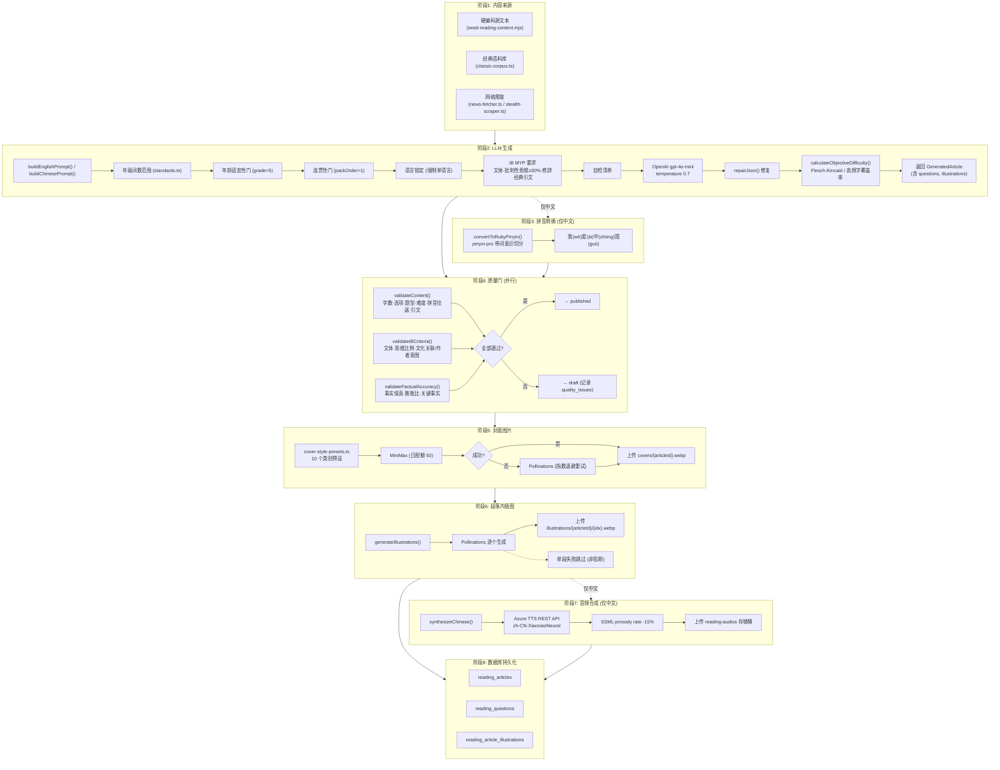
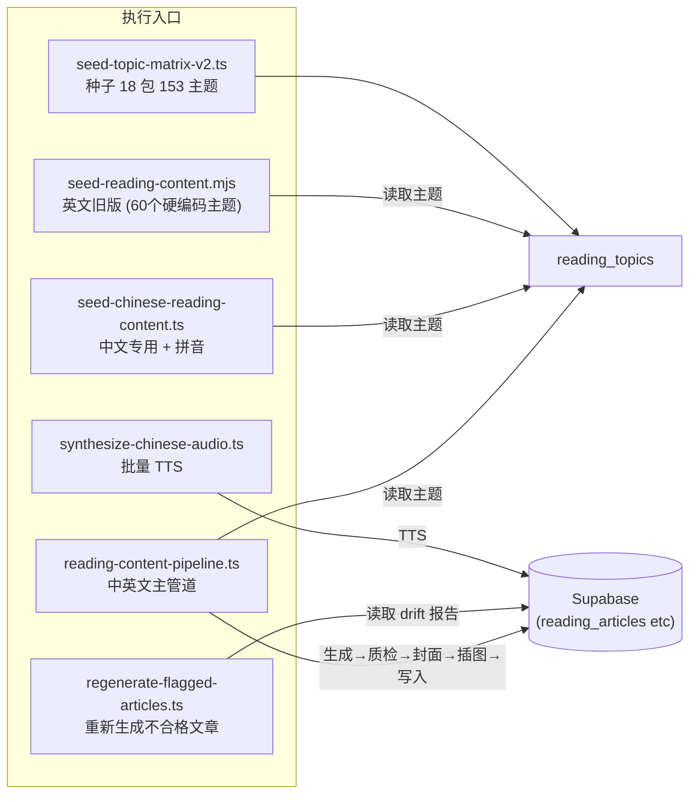

# 中英文文章生产加工流程

## 执行脚本

## 关键文件索引

| 文件 | 职责 |
|------|------|
| `src/lib/reading/content-generator.ts` | LLM 提示构建 + OpenAI 调用 + JSON 修复 |
| `src/lib/reading/pinyin-converter.ts` | 逐字 ruby 拼音 |
| `src/lib/reading/quality-gate.ts` | 6 项客观质量检查 |
| `src/lib/reading/ib-criteria-gate.ts` | IB MYP 文体/思维/文化门 |
| `src/lib/reading/factual-gate.ts` | 来源文本保真度门 |
| `src/lib/reading/difficulty.ts` | Flesch-Kincaid / 高频字覆盖率 |
| `src/lib/reading/standards.ts` | 各年级字数/字符数规格 |
| `src/lib/reading/cover-generator.ts` | MiniMax → Pollinations 封面 |
| `src/lib/reading/illustration-generator.ts` | Pollinations 段落插图 |
| `src/lib/reading/cover-style-presets.ts` | 10 个类别图片提示词预设 |
| `src/lib/reading/tts-azure-client.ts` | Azure TTS 合成 |
| `src/lib/reading/storage-uploader.ts` | Supabase 存储上传 |
| `src/lib/reading/concurrency.ts` | Pacer(3) + withRetry 指数退避 |
| `src/lib/reading/json-recovery.ts` | JSON 修复回退策略 |
